# Diagram Support

Introligo provides comprehensive support for including various diagram types in your documentation, making it easy to visualize architectures, flows, and relationships.

## Overview

Diagrams help communicate complex concepts visually. Introligo supports multiple diagram formats and automatically handles rendering when extensions are available, or falls back to displaying diagram code when they're not.

## Supported Diagram Types

✅ **PlantUML** - UML diagrams (sequence, class, activity, component, etc.)
✅ **Mermaid** - Flowcharts, sequence diagrams, Gantt charts, and more
✅ **Graphviz** - Directed graphs and network diagrams
✅ **SVG** - Static vector graphics
✅ **Auto-Fallback** - Graceful degradation to code blocks
✅ **File or Inline** - Include from files or define inline

## Quick Start

### 1. Install Extensions (Optional)

For rendered diagrams:

```bash
# Install Python extensions
pip install sphinxcontrib-plantuml sphinxcontrib-mermaid

# Install PlantUML (requires Java)
sudo apt install default-jre plantuml

# Verify installation
plantuml -version
```

**Note:** If extensions aren't installed, diagrams display as syntax-highlighted code blocks automatically.

### 2. Add Diagrams to Your Config

```yaml
modules:
  architecture:
    title: "System Architecture"
    description: "Overview of system components"

    diagram_includes:
      - path: "diagrams/architecture.puml"
        title: "High-Level Architecture"
```

### 3. Generate Documentation

```bash
python -m introligo config.yaml -o docs/
```

## PlantUML Diagrams

### What is PlantUML?

PlantUML is a versatile tool for creating UML diagrams from plain text descriptions.

### Supported Diagram Types

- **Sequence Diagrams** - Message flows between actors
- **Class Diagrams** - Object-oriented structure
- **Activity Diagrams** - Workflows and processes
- **Component Diagrams** - System components
- **Use Case Diagrams** - User interactions
- **State Diagrams** - State machines
- And many more!

### Basic Example

**diagrams/sequence.puml:**
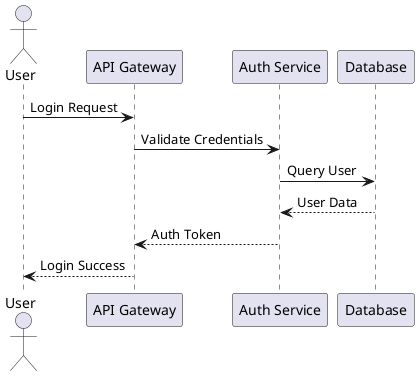

**introligo_config.yaml:**
```yaml
modules:
  authentication:
    title: "Authentication Flow"
    description: "User authentication process"

    diagram_includes:
      - path: "diagrams/sequence.puml"
        title: "Login Sequence"
```

### Class Diagram Example

**diagrams/domain_model.puml:**
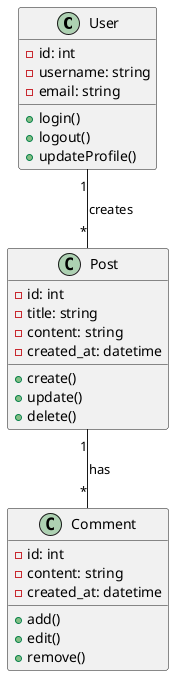

### Component Diagram Example

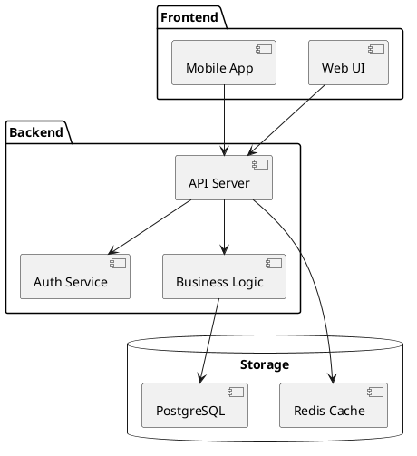

## Mermaid Diagrams

### What is Mermaid?

Mermaid creates diagrams using a simple markdown-like syntax.

### Supported Diagram Types

- **Flowcharts** - Decision trees and processes
- **Sequence Diagrams** - Interaction flows
- **Gantt Charts** - Project timelines
- **Pie Charts** - Data visualization
- **State Diagrams** - State transitions
- **Git Graphs** - Version control flows

### Flowchart Example

**diagrams/flowchart.mmd:**
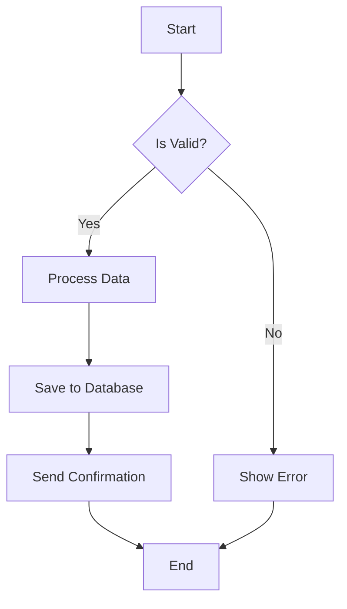

**introligo_config.yaml:**
```yaml
modules:
  data_processing:
    title: "Data Processing Pipeline"

    diagram_includes:
      - path: "diagrams/flowchart.mmd"
        title: "Processing Flow"
```

### Sequence Diagram Example

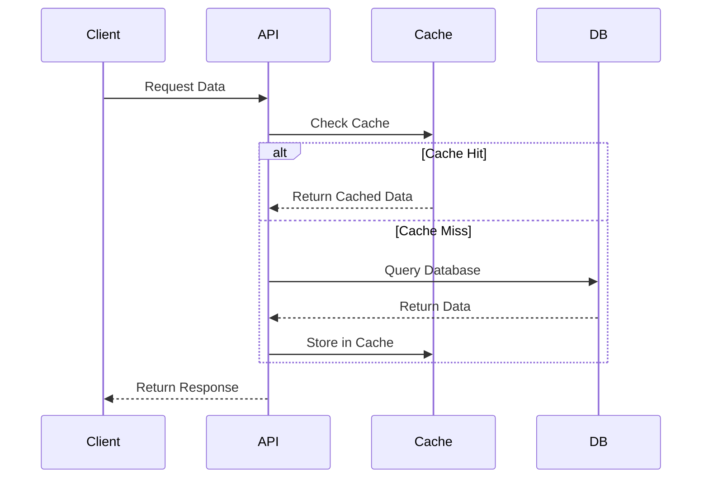

### Gantt Chart Example

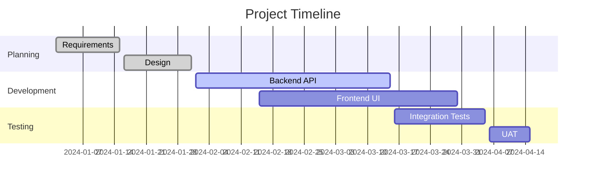

## Graphviz Diagrams

### What is Graphviz?

Graphviz creates graph visualizations using the DOT language.

### Use Cases

- Network topologies
- Dependency graphs
- Organizational charts
- State machines
- Data flow diagrams

### Architecture Example

**diagrams/architecture.dot:**
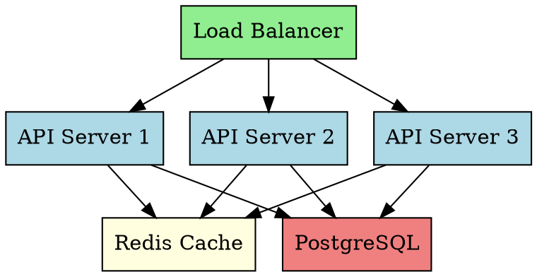

### Dependency Graph Example

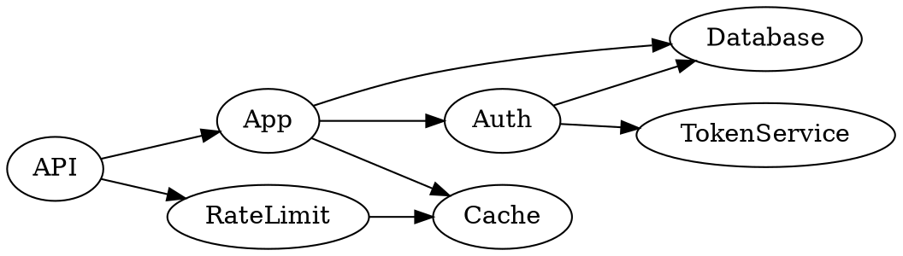

## SVG Images

### Static Vector Graphics

For pre-rendered diagrams or custom graphics:

```yaml
modules:
  design:
    title: "UI Design"

    diagram_includes:
      - path: "images/mockup.svg"
        title: "Interface Mockup"
        alt_text: "Mobile app interface design"
```

## Configuration Options

### Single Diagram

```yaml
modules:
  my_module:
    title: "Module Title"

    diagram_includes:
      - path: "diagrams/my_diagram.puml"
        title: "Diagram Title"  # Optional
```

### Multiple Diagrams

```yaml
modules:
  all_diagrams:
    title: "System Overview"

    diagram_includes:
      - path: "diagrams/architecture.puml"
        title: "Architecture"
      - path: "diagrams/sequence.puml"
        title: "Authentication Flow"
      - path: "diagrams/dataflow.mmd"
        title: "Data Processing"
```

### Inline Diagrams in Custom Sections

```yaml
modules:
  inline_example:
    title: "Inline Diagrams"

    custom_sections:
      - title: "Simple Flow"
        content: |
          .. graphviz::

             digraph Simple {
                A -> B -> C;
                A -> C;
             }
```

## Auto-Detection and Fallback

### How It Works

1. **Detection Phase** - Introligo scans your config for diagram files
2. **Extension Check** - Checks if rendering extensions are installed
3. **Directive Generation** - Generates appropriate RST directives
4. **Fallback** - If extensions missing, uses code blocks instead

### With Extensions Installed

```rst
Architecture Diagram
~~~~~~~~~~~~~~~~~~~~

.. uml::

   @startuml
   [Component A] --> [Component B]
   @enduml
```

**Result:** Rendered diagram image ✅

### Without Extensions

```rst
Architecture Diagram
~~~~~~~~~~~~~~~~~~~~

.. code-block:: plantuml

   @startuml
   [Component A] --> [Component B]
   @enduml
```

**Result:** Syntax-highlighted code block ✅

### Configuration Detection

Introligo automatically detects and configures extensions:

```yaml
# You write this:
modules:
  my_module:
    diagram_includes:
      - path: "diagram.puml"

# Introligo automatically adds:
sphinx:
  extensions:
    - sphinxcontrib.plantuml  # If installed
    - sphinxcontrib.mermaid   # If installed
    - sphinx.ext.graphviz     # Always available
```

## Installation Guide

### PlantUML Setup

#### Ubuntu/Debian (WSL):

```bash
# Install Java
sudo apt update
sudo apt install default-jre

# Install PlantUML
sudo apt install plantuml

# Install Python extension
pip install sphinxcontrib-plantuml

# Verify
plantuml -version
```

#### Manual Installation:

```bash
# Install Java
sudo apt install default-jre

# Download PlantUML JAR
sudo mkdir -p /opt/plantuml
sudo wget https://github.com/plantuml/plantuml/releases/download/v1.2024.3/plantuml-1.2024.3.jar -O /opt/plantuml/plantuml.jar

# Create wrapper script
sudo tee /usr/local/bin/plantuml > /dev/null << 'EOF'
#!/bin/bash
java -jar /opt/plantuml/plantuml.jar "$@"
EOF

sudo chmod +x /usr/local/bin/plantuml

# Install Python extension
pip install sphinxcontrib-plantuml
```

### Mermaid Setup

```bash
pip install sphinxcontrib-mermaid
```

**Note:** Mermaid rendering happens in the browser via JavaScript, no additional tools needed.

### Graphviz Setup

```bash
# Install Graphviz
sudo apt install graphviz

# Python extension (built into Sphinx)
# sphinx.ext.graphviz - automatically available
```

### Configure PlantUML Path (Optional)

If PlantUML isn't in your PATH:

```yaml
sphinx:
  plantuml: "java -jar /opt/plantuml/plantuml.jar"
  # Or for package manager install:
  # plantuml: "plantuml"
```

## Project Structure

### Recommended Layout

```
myproject/
├── introligo_config.yaml
├── diagrams/
│   ├── architecture/
│   │   ├── system_overview.puml
│   │   ├── component_diagram.puml
│   │   └── deployment.dot
│   ├── flows/
│   │   ├── authentication.puml
│   │   ├── data_processing.mmd
│   │   └── user_journey.mmd
│   └── models/
│       ├── domain_model.puml
│       └── database_schema.puml
└── docs/
    └── (generated documentation)
```

### Naming Conventions

```
# Good - descriptive names
authentication_flow.puml
user_registration_sequence.puml
system_architecture.dot
data_processing_flowchart.mmd

# Avoid - vague names
diagram1.puml
flow.mmd
pic.svg
```

## Complete Example

### Project Setup

**introligo_config.yaml:**
```yaml
sphinx:
  project: "MyApp Documentation"
  author: "Development Team"
  html_theme: "furo"

index:
  title: "MyApp Documentation"
  description: "Complete system documentation with diagrams"

modules:
  architecture:
    title: "System Architecture"
    description: "High-level system design and components"

    overview: |
      Our system follows a microservices architecture with
      clear separation of concerns.

    diagram_includes:
      - path: "diagrams/architecture/system_overview.puml"
        title: "System Overview"
      - path: "diagrams/architecture/deployment.dot"
        title: "Deployment Diagram"

  authentication:
    title: "Authentication"
    description: "User authentication and authorization"

    diagram_includes:
      - path: "diagrams/flows/authentication.puml"
        title: "Login Flow"
      - path: "diagrams/flows/oauth_flow.puml"
        title: "OAuth2 Flow"

  data_model:
    title: "Data Model"
    description: "Domain model and relationships"

    diagram_includes:
      - path: "diagrams/models/domain_model.puml"
        title: "Domain Model"

  workflows:
    title: "Workflows"
    description: "Business process workflows"

    diagram_includes:
      - path: "diagrams/flows/order_processing.mmd"
        title: "Order Processing"
      - path: "diagrams/flows/payment_flow.mmd"
        title: "Payment Flow"
```

## Best Practices

### 1. Organize Diagrams by Category

```
diagrams/
├── architecture/  # System design
├── flows/         # Process flows
├── models/        # Data models
└── ui/            # UI/UX diagrams
```

### 2. Use Descriptive Titles

```yaml
# Good
diagram_includes:
  - path: "diagrams/auth_flow.puml"
    title: "User Authentication Flow"

# Less clear
diagram_includes:
  - path: "diagrams/auth_flow.puml"
    title: "Diagram"
```

### 3. Keep Diagrams Simple

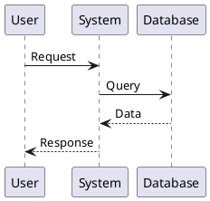

Avoid cramming too much information into one diagram.

### 4. Use Consistent Styling

```plantuml
@startuml
' Define common styles
skinparam backgroundColor #FFFFFF
skinparam componentStyle rectangle
skinparam component {
  BackgroundColor lightblue
  BorderColor darkblue
}

[Component A]
[Component B]
@enduml
```

### 5. Add Comments

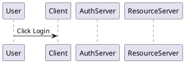

### 6. Version Control Diagram Source

- Keep `.puml`, `.mmd`, `.dot` files in version control
- Don't commit generated images (if using rendering)
- Review diagram changes in pull requests

### 7. Document Diagram Conventions

Create a style guide:

```yaml
modules:
  diagram_conventions:
    title: "Diagram Conventions"
    overview: |
      **Color Coding:**
      - Blue: Core services
      - Green: External services
      - Yellow: Caching layer
      - Red: Critical paths

      **Shapes:**
      - Rectangles: Services/Components
      - Cylinders: Databases
      - Clouds: External APIs
```

## Troubleshooting

### Diagrams Show as Code Blocks

**Problem:** Diagrams display as code instead of rendered images

**Solution:**
1. Check if extensions are installed:
   ```bash
   python -c "import sphinxcontrib.plantuml; print('OK')"
   ```
2. Install missing extensions:
   ```bash
   pip install sphinxcontrib-plantuml sphinxcontrib-mermaid
   ```
3. For PlantUML, ensure the executable is available:
   ```bash
   plantuml -version
   ```

### "plantuml command cannot be run"

**Problem:** Extension installed but PlantUML not found

**Solution:**
```bash
# Install PlantUML
sudo apt install plantuml

# Or configure path in config:
sphinx:
  plantuml: "java -jar /path/to/plantuml.jar"
```

### Syntax Errors in Diagrams

**Problem:** Diagram fails to render

**Solution:**
1. Test diagram syntax separately:
   ```bash
   plantuml -testdot
   plantuml diagram.puml
   ```
2. Check for common issues:
   - Missing `@startuml` / `@enduml`
   - Unmatched quotes or brackets
   - Invalid syntax for diagram type

### File Not Found

**Problem:** `PlantUML file not found: diagrams/my_diagram.puml`

**Solution:** Check path is relative to config file:
```yaml
# If config is in project root:
diagram_includes:
  - path: "diagrams/my_diagram.puml"  # → ./diagrams/my_diagram.puml

# If config is in docs/ folder:
diagram_includes:
  - path: "../diagrams/my_diagram.puml"  # → ../diagrams/my_diagram.puml
```

### Pygments Lexer Warnings

**Problem:** `WARNING: Pygments lexer name 'plantuml' is not known`

**These are harmless warnings** when extensions aren't installed. Code blocks still display correctly, just without syntax highlighting.

To eliminate warnings, install the extensions or the code will use generic text highlighting automatically.

## Diagram Type Comparison

| Type | Best For | Rendering | Learning Curve |
|------|----------|-----------|----------------|
| **PlantUML** | UML diagrams, sequences, classes | Server-side | Medium |
| **Mermaid** | Flowcharts, simple diagrams | Browser-side | Easy |
| **Graphviz** | Network graphs, dependencies | Server-side | Medium |
| **SVG** | Custom graphics, mockups | Static file | N/A |

## Advanced Features

### Conditional Rendering

```yaml
modules:
  architecture:
    title: "Architecture"

    # Production diagram
    diagram_includes:
      - path: "diagrams/prod_architecture.puml"
        title: "Production Environment"

  architecture_dev:
    parent: "architecture"
    title: "Development Environment"

    # Development diagram
    diagram_includes:
      - path: "diagrams/dev_architecture.puml"
        title: "Development Setup"
```

### Combining Diagram Types

```yaml
modules:
  complete_overview:
    title: "System Overview"

    overview: |
      Complete system architecture and workflows.

    diagram_includes:
      # High-level architecture (Graphviz)
      - path: "diagrams/system.dot"
        title: "System Components"

      # Detailed flow (PlantUML)
      - path: "diagrams/request_flow.puml"
        title: "Request Processing"

      # Process workflow (Mermaid)
      - path: "diagrams/business_process.mmd"
        title: "Business Workflow"
```

### External Diagram Links

```yaml
modules:
  external_diagrams:
    title: "Additional Diagrams"

    see_also:
      - "Lucidchart: https://lucid.app/documents/view/..."
      - "Draw.io: https://app.diagrams.net/..."
      - "Figma: https://www.figma.com/file/..."
```

## Complete Example: C++ Library with Diagrams and Markdown

This example shows how to create comprehensive documentation for a C++ library that combines:
- **Architecture diagrams** (PlantUML & Graphviz)
- **Markdown documentation** (user guides, tutorials)
- **C++ API documentation** (Doxygen integration)

### Project Structure

```
my_cpp_library/
├── include/
│   └── mylib/
│       ├── queue.h
│       └── processor.h
├── src/
│   ├── queue.cpp
│   └── processor.cpp
├── docs/
│   ├── introligo_config.yaml
│   ├── doxygen_config/
│   │   └── Doxyfile
│   ├── diagrams/
│   │   ├── architecture.dot
│   │   ├── class_diagram.puml
│   │   └── data_flow.mmd
│   ├── markdown/
│   │   ├── overview.md
│   │   ├── installation.md
│   │   └── usage_guide.md
│   └── _build/  (generated)
└── examples/
    └── example.cpp
```

### 1. Create Architecture Diagrams

**docs/diagrams/architecture.dot** (Graphviz):
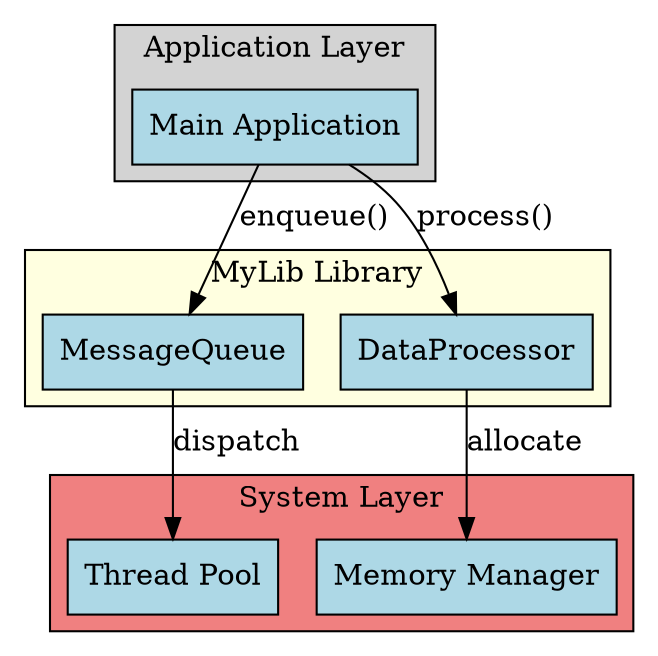

**docs/diagrams/class_diagram.puml** (PlantUML):
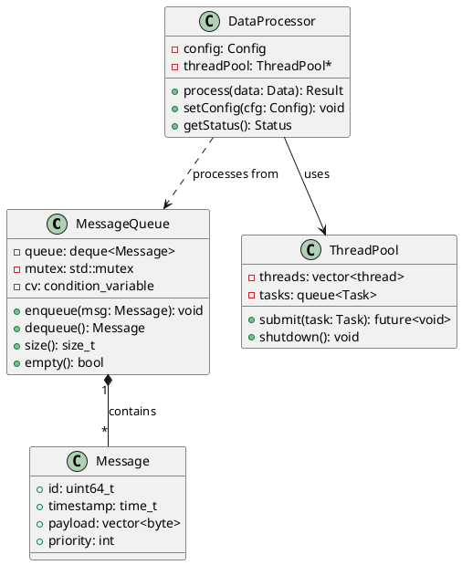

**docs/diagrams/data_flow.mmd** (Mermaid):
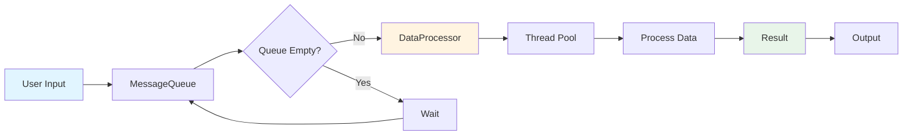

### 2. Create Markdown Documentation

**docs/markdown/overview.md**:
````markdown
# Library Overview

MyLib is a high-performance C++ library for concurrent data processing with built-in message queuing capabilities.

## Key Features

- **Thread-Safe Queue**: Lock-free message queue with priority support
- **Concurrent Processing**: Multi-threaded data processor with configurable thread pool
- **Zero-Copy Operations**: Efficient memory management for high throughput
- **Cross-Platform**: Works on Linux, Windows, and macOS

## Architecture

The library consists of two main components:

### MessageQueue

A thread-safe, lock-free queue implementation that supports:
- Multiple producers and consumers
- Priority-based message ordering
- Blocking and non-blocking operations
- Configurable capacity limits

### DataProcessor

A high-performance data processor that provides:
- Parallel processing using thread pool
- Configurable processing strategies
- Real-time status monitoring
- Error handling and recovery

## Use Cases

1. **Real-time Data Processing**: Process incoming sensor data streams
2. **Message Broker**: Build custom messaging systems
3. **Task Scheduling**: Distribute computational tasks across threads
4. **Event Processing**: Handle application events asynchronously
````

**docs/markdown/installation.md**:
````markdown
# Installation Guide

## Requirements

- C++17 compatible compiler (GCC 9+, Clang 10+, MSVC 2019+)
- CMake 3.15 or higher
- pthread library (Linux/macOS)

## Building from Source

### Linux/macOS

```bash
# Clone the repository
git clone https://github.com/example/mylib.git
cd mylib

# Create build directory
mkdir build && cd build

# Configure with CMake
cmake .. -DCMAKE_BUILD_TYPE=Release

# Build the library
cmake --build . --parallel

# Install (optional)
sudo cmake --install .
```

### Windows

```powershell
# Clone and navigate to repository
git clone https://github.com/example/mylib.git
cd mylib

# Create build directory
mkdir build
cd build

# Configure with Visual Studio
cmake .. -G "Visual Studio 16 2019"

# Build
cmake --build . --config Release
```

## CMake Integration

Add to your `CMakeLists.txt`:

```cmake
find_package(MyLib REQUIRED)
target_link_libraries(your_target PRIVATE MyLib::MyLib)
```

## Package Managers

### vcpkg

```bash
vcpkg install mylib
```

### Conan

```bash
conan install mylib/1.0.0@
```
````

**docs/markdown/usage_guide.md**:
````markdown
# Usage Guide

## Basic Example

Here's a simple example of using the MessageQueue and DataProcessor:

```cpp
#include <mylib/queue.h>
#include <mylib/processor.h>
#include <iostream>

int main() {
    // Create a message queue
    mylib::MessageQueue queue(100);  // capacity: 100

    // Create a data processor
    mylib::DataProcessor processor;

    // Enqueue messages
    for (int i = 0; i < 10; ++i) {
        mylib::Message msg;
        msg.id = i;
        msg.payload = {/* data */};
        queue.enqueue(msg);
    }

    // Process messages
    while (!queue.empty()) {
        auto msg = queue.dequeue();
        auto result = processor.process(msg);
        std::cout << "Processed message " << msg.id << std::endl;
    }

    return 0;
}
```

## Advanced Usage

### Multi-threaded Processing

```cpp
#include <mylib/queue.h>
#include <mylib/processor.h>
#include <thread>
#include <vector>

void worker(mylib::MessageQueue& queue, mylib::DataProcessor& processor) {
    while (true) {
        auto msg = queue.dequeue();  // Blocks if queue is empty
        if (msg.id == 0) break;      // Exit signal

        auto result = processor.process(msg);
        // Handle result...
    }
}

int main() {
    mylib::MessageQueue queue(1000);
    mylib::DataProcessor processor;

    // Start worker threads
    std::vector<std::thread> workers;
    for (int i = 0; i < 4; ++i) {
        workers.emplace_back(worker, std::ref(queue), std::ref(processor));
    }

    // Producer: enqueue messages
    for (int i = 1; i <= 100; ++i) {
        mylib::Message msg;
        msg.id = i;
        queue.enqueue(msg);
    }

    // Send exit signals
    for (size_t i = 0; i < workers.size(); ++i) {
        queue.enqueue(mylib::Message{0});
    }

    // Wait for workers
    for (auto& w : workers) {
        w.join();
    }

    return 0;
}
```

### Configuration

```cpp
mylib::Config config;
config.threadPoolSize = 8;
config.maxQueueSize = 10000;
config.processingStrategy = mylib::Strategy::PARALLEL;

processor.setConfig(config);
```

## Error Handling

```cpp
try {
    auto result = processor.process(msg);
    if (!result.success) {
        std::cerr << "Processing failed: " << result.error << std::endl;
    }
} catch (const mylib::QueueFullException& e) {
    std::cerr << "Queue is full: " << e.what() << std::endl;
} catch (const mylib::ProcessingException& e) {
    std::cerr << "Processing error: " << e.what() << std::endl;
}
```
````

### 3. Configure Doxygen

**docs/doxygen_config/Doxyfile**:
```
PROJECT_NAME           = "MyLib"
OUTPUT_DIRECTORY       = doxygen_output
INPUT                  = ../../include
RECURSIVE              = YES
GENERATE_XML           = YES
GENERATE_HTML          = NO
XML_OUTPUT             = xml
```

Generate Doxygen XML:
```bash
cd docs/doxygen_config
doxygen Doxyfile
```

### 4. Create Introligo Configuration

**docs/introligo_config.yaml**:
```yaml
# Sphinx configuration
sphinx:
  project: "MyLib Documentation"
  author: "Development Team"
  version: "1.0.0"
  html_theme: "furo"

  extensions:
    - "sphinx.ext.autodoc"
    - "breathe"
    - "sphinx.ext.graphviz"

# Doxygen/Breathe configuration
doxygen:
  project_name: "mylib"
  xml_path: "doxygen_config/doxygen_output/xml"

index:
  title: "MyLib - High-Performance C++ Library"
  description: "Thread-safe message queue and concurrent data processor"
  overview: |
    **MyLib** is a modern C++ library designed for high-performance concurrent
    data processing with built-in message queuing capabilities.

modules:
  # ========================================
  # OVERVIEW WITH ARCHITECTURE DIAGRAMS
  # ========================================
  overview:
    title: "Overview"
    description: "Library overview and architecture"

    # Include markdown overview
    markdown_includes: "markdown/overview.md"

    # Add architecture diagrams
    diagram_includes:
      - path: "diagrams/architecture.dot"
        title: "System Architecture"
      - path: "diagrams/class_diagram.puml"
        title: "Class Diagram"
      - path: "diagrams/data_flow.mmd"
        title: "Data Flow"

  # ========================================
  # GETTING STARTED
  # ========================================
  getting_started:
    title: "Getting Started"
    description: "Installation and basic usage"

  installation:
    parent: "getting_started"
    title: "Installation"
    description: "Build and installation instructions"
    markdown_includes: "markdown/installation.md"

  usage_guide:
    parent: "getting_started"
    title: "Usage Guide"
    description: "Examples and tutorials"
    markdown_includes: "markdown/usage_guide.md"

  # ========================================
  # API REFERENCE (C++ with Doxygen)
  # ========================================
  api_reference:
    title: "API Reference"
    description: "Complete C++ API documentation"
    language: "cpp"

  message_queue_api:
    parent: "api_reference"
    title: "MessageQueue"
    description: "Thread-safe message queue implementation"
    language: "cpp"
    doxygen_class: "mylib::MessageQueue"

    overview: |
      The `MessageQueue` class provides a thread-safe queue for message passing
      between threads. It supports both blocking and non-blocking operations.

      **Key Features:**
      - Lock-free implementation for high performance
      - Priority-based message ordering
      - Configurable capacity limits
      - Blocking and non-blocking operations

  data_processor_api:
    parent: "api_reference"
    title: "DataProcessor"
    description: "Concurrent data processing engine"
    language: "cpp"
    doxygen_class: "mylib::DataProcessor"

    overview: |
      The `DataProcessor` class handles concurrent data processing using an
      internal thread pool. It provides various processing strategies and
      real-time status monitoring.

      **Key Features:**
      - Configurable thread pool size
      - Multiple processing strategies
      - Status monitoring and metrics
      - Error handling and recovery

  thread_pool_api:
    parent: "api_reference"
    title: "ThreadPool"
    description: "Thread pool management"
    language: "cpp"
    doxygen_class: "mylib::ThreadPool"

  # ========================================
  # EXAMPLES
  # ========================================
  examples:
    title: "Examples"
    description: "Code examples and use cases"

    overview: |
      Practical examples demonstrating various use cases and patterns.

    examples:
      - title: "Basic Usage"
        language: "cpp"
        description: "Simple message queue and processor example"
        code: |
          #include <mylib/queue.h>
          #include <mylib/processor.h>

          int main() {
              mylib::MessageQueue queue(100);
              mylib::DataProcessor processor;

              // Enqueue messages
              for (int i = 0; i < 10; ++i) {
                  mylib::Message msg;
                  msg.id = i;
                  queue.enqueue(msg);
              }

              // Process messages
              while (!queue.empty()) {
                  auto msg = queue.dequeue();
                  processor.process(msg);
              }

              return 0;
          }

      - title: "Multi-threaded Processing"
        language: "cpp"
        description: "Using multiple worker threads"
        code: |
          #include <mylib/queue.h>
          #include <mylib/processor.h>
          #include <thread>
          #include <vector>

          void worker(mylib::MessageQueue& q, mylib::DataProcessor& p) {
              while (true) {
                  auto msg = q.dequeue();
                  if (msg.id == 0) break;
                  p.process(msg);
              }
          }

          int main() {
              mylib::MessageQueue queue(1000);
              mylib::DataProcessor processor;

              // Start workers
              std::vector<std::thread> workers;
              for (int i = 0; i < 4; ++i) {
                  workers.emplace_back(worker,
                      std::ref(queue), std::ref(processor));
              }

              // ... produce messages ...

              // Send exit signals
              for (size_t i = 0; i < workers.size(); ++i) {
                  queue.enqueue(mylib::Message{0});
              }

              for (auto& w : workers) w.join();
              return 0;
          }
```

### 5. Generate Documentation

```bash
cd docs

# Step 1: Generate Doxygen XML
cd doxygen_config
doxygen Doxyfile
cd ..

# Step 2: Generate RST files with Introligo
python -m introligo introligo_config.yaml -o build/

# Step 3: Build with Sphinx
sphinx-build -b html build/ build/_html/

# View the documentation
firefox build/_html/index.html
```

### 6. Result Structure

The generated documentation will have:

```
📚 MyLib Documentation
├── 🏠 Overview
│   ├── Library Overview (markdown)
│   ├── System Architecture (Graphviz diagram)
│   ├── Class Diagram (PlantUML diagram)
│   └── Data Flow (Mermaid diagram)
├── 🚀 Getting Started
│   ├── Installation (markdown with code blocks)
│   └── Usage Guide (markdown with C++ examples)
├── 📖 API Reference
│   ├── MessageQueue (Doxygen C++ API)
│   ├── DataProcessor (Doxygen C++ API)
│   └── ThreadPool (Doxygen C++ API)
└── 💡 Examples
    ├── Basic Usage (C++ code)
    └── Multi-threaded Processing (C++ code)
```

### 7. What Makes This Powerful

This example demonstrates:

✅ **Visual Architecture** - Graphviz shows system components
✅ **UML Diagrams** - PlantUML illustrates class relationships
✅ **Flow Diagrams** - Mermaid shows data processing flow
✅ **Rich Documentation** - Markdown for guides and tutorials
✅ **API Documentation** - Doxygen for C++ code
✅ **Code Examples** - Inline C++ examples
✅ **Single Source** - Everything in one YAML config
✅ **Professional Output** - Beautiful Sphinx documentation

### 8. Benefits

**For Developers:**
- Visual understanding of architecture
- Detailed API documentation
- Practical usage examples
- Easy-to-follow installation guide

**For Maintainers:**
- Single configuration file
- Automatic diagram rendering
- Markdown for easy editing
- Version control friendly

**For Users:**
- Professional documentation
- Clear examples
- Visual guides
- Complete reference

This approach combines the best of all worlds: visual diagrams for architecture, markdown for narratives, and Doxygen for API reference!

## Summary

Introligo's diagram support provides:

✅ **Multiple Formats** - PlantUML, Mermaid, Graphviz, SVG
✅ **Auto-Detection** - Automatic extension configuration
✅ **Graceful Fallback** - Code blocks when extensions unavailable
✅ **File or Inline** - Flexible inclusion methods
✅ **Easy Integration** - Simple YAML configuration
✅ **Production Ready** - Handles missing dependencies gracefully

Start visualizing your documentation today!

## See Also

- [PlantUML Documentation](https://plantuml.com/)
- [Mermaid Documentation](https://mermaid.js.org/)
- [Graphviz Documentation](https://graphviz.org/)
- [Sphinx Diagram Extensions](https://www.sphinx-doc.org/)
- [Example Diagram Project](../../examples/diagram_project/)

## Quick Reference

### PlantUML File

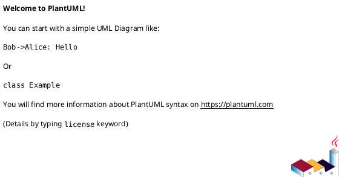

### Mermaid File

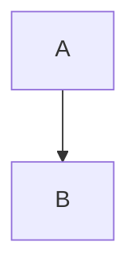

### Graphviz File

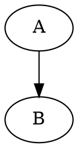

### Config Entry

```yaml
modules:
  my_module:
    diagram_includes:
      - path: "diagrams/my_diagram.puml"
        title: "My Diagram"
```
