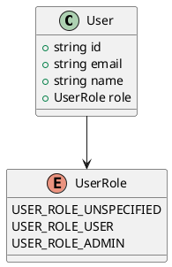
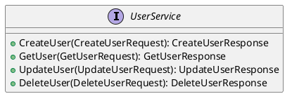
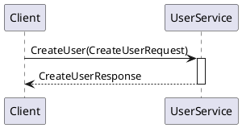
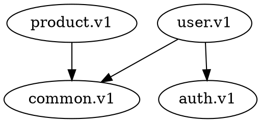

# Protocol Buffers (Protobuf) Language Support

Introligo provides automatic documentation extraction for Protocol Buffer definitions, seamlessly integrating protobuf API documentation into your Sphinx site.

## Contents

- [Overview](#overview)
- [Features](#features)
- [Basic Usage](#basic-usage)
- [Complete Example](#complete-example)
- [Comment Styles](#comment-styles)
- [AsyncAPI Validation Keywords](#asyncapi-validation-keywords)
- [Automatic Diagram Generation](#automatic-diagram-generation)
- [Configuration Options](#configuration-options)
- [gRPC Integration](#grpc-integration)
- [Best Practices](#best-practices)
- [Troubleshooting](#troubleshooting)
- [Comparison with Other Languages](#comparison-with-other-languages)

## Overview

Protocol Buffers documentation is extracted directly from .proto source files by parsing comments and converting them to reStructuredText format. This provides a clean, native Sphinx experience for documenting gRPC APIs, message definitions, and service contracts.

See also: [Language Support Overview](overview.md) for how Protobuf compares to other supported languages.

## Features

- ✅ **Automatic Extraction** - Parses .proto files directly and extracts documentation comments (see [How It Works](#how-it-works))
- ✅ **RST Conversion** - Converts protobuf comments to properly formatted reStructuredText
- ✅ **Seamless Integration** - Extracted docs appear directly in your Sphinx site
- ✅ **No External Tools Required** - Works by reading .proto sources directly (protoc optional)
- ✅ **AsyncAPI Keywords** - Supports validation keywords (see [AsyncAPI Validation Keywords](#asyncapi-validation-keywords))
- ✅ **Cross-References** - Use @Ref to link between related types
- ✅ **Automatic Diagram Generation** - Create UML diagrams from proto files (see [Automatic Diagram Generation](#automatic-diagram-generation))
- ✅ **Manual Override** - Option to provide manual documentation when needed (see [Manual Documentation Fallback](#manual-documentation-fallback))

## Basic Usage

### Minimal Configuration

```yaml
modules:
  my_api:
    title: "My API"
    language: protobuf
    proto_path: "protos"
```

### Configuration Fields

| Field | Description | Required | See Also |
|-------|-------------|----------|----------|
| `language: protobuf` | Specifies Protocol Buffers language | Yes | [Complete Example](#complete-example) |
| `proto_path` | Path to directory containing .proto files (relative to config) | Recommended | [Package-Level Documentation](#package-level-documentation) |
| `proto_files` | List of specific .proto files to document | Optional | [File-Level Documentation](#file-level-documentation) |
| `proto_package` | Package name for filtering (e.g., user.v1) | Optional | [Package-Level Documentation](#package-level-documentation) |
| `protobuf_diagrams` | List of diagrams to auto-generate | Optional | [Automatic Diagram Generation](#automatic-diagram-generation) |
| `protodoc_manual_content` | Manual documentation (fallback) | Optional | [Manual Documentation Fallback](#manual-documentation-fallback) |

## How It Works

### Automatic Extraction Process

1. **Detection**: Introligo detects `language: protobuf` in your configuration
2. **File Discovery**: Finds .proto source files in the specified path
3. **Parsing**: Reads proto files and extracts comments (// and /\* \*/ styles)
4. **Conversion**: Parses messages, enums, services and converts to RST
5. **Integration**: Injects the formatted documentation into your Sphinx build

### Example Flow

```
Your YAML Config
    ↓
Introligo Generator
    ↓
Read .proto Source Files
    ↓
Parse Comments & Structure
    ↓
Extract Messages, Enums, Services
    ↓
Convert to RST Format
    ↓
Beautiful Documentation!
```

## Complete Example

```yaml
sphinx:
  project: "User Service API"
  html_theme: "furo"

modules:
  api_reference:
    title: "API Reference"
    description: "Complete API documentation"

  user_service:
    parent: "api_reference"
    title: "User Service"
    language: protobuf
    description: "gRPC service for user account management"

    # Proto configuration
    proto_path: "protos"

    # Optional: Specify specific files
    # proto_files:
    #   - "user.proto"

    # Optional: Filter by package
    # proto_package: "user.v1"

    # Your narrative documentation
    overview: |
      The User Service provides a gRPC API for managing user accounts.
      It supports creating, reading, updating, and deleting user records
      with proper role-based access control.

    features:
      - "Full CRUD operations for user management"
      - "Role-based access control"
      - "Type-safe protobuf definitions"
      - "gRPC streaming support ready"

    usage_examples:
      - title: "Python Client"
        language: "python"
        code: |
          import grpc
          from user.v1 import user_pb2, user_pb2_grpc

          channel = grpc.insecure_channel('localhost:50051')
          stub = user_pb2_grpc.UserServiceStub(channel)

          request = user_pb2.CreateUserRequest(
              email="alice@example.com",
              name="Alice Smith"
          )
          response = stub.CreateUser(request)
          print(f"Created user: {response.user.id}")

      - title: "Go Client"
        language: "go"
        code: |
          conn, _ := grpc.Dial("localhost:50051", grpc.WithInsecure())
          defer conn.Close()

          client := pb.NewUserServiceClient(conn)
          req := &pb.CreateUserRequest{
              Email: "bob@example.com",
              Name:  "Bob Johnson",
          }
          resp, _ := client.CreateUser(context.Background(), req)

    installation: |
      To use this service, generate client code from the proto files:

      **Python:**

      .. code-block:: bash

         python -m grpc_tools.protoc -I./protos --python_out=. \
                --grpc_python_out=. protos/user.proto

      **Go:**

      .. code-block:: bash

         protoc --go_out=. --go_opt=paths=source_relative \
                --go-grpc_out=. --go-grpc_opt=paths=source_relative \
                protos/user.proto
```

## Generated Documentation

The above configuration generates documentation with:

### Message Documentation

```protobuf
message User {
    string id = 1;
    string email = 2;
    string name = 3;
    UserRole role = 4;
}
```

User represents a user account in the system.

**Fields:**
- `id` (string): Unique identifier for the user
- `email` (string): User's email address
- `name` (string): User's display name
- `role` (UserRole): User's role in the system

### Enum Documentation

```protobuf
enum UserRole {
    USER_ROLE_UNSPECIFIED = 0;
    USER_ROLE_USER = 1;
    USER_ROLE_ADMIN = 2;
}
```

**Values:**
- `USER_ROLE_UNSPECIFIED`: Unknown or unspecified role
- `USER_ROLE_USER`: Regular user with basic permissions
- `USER_ROLE_ADMIN`: Administrator with elevated permissions

### Service Documentation

```protobuf
service UserService {
    rpc CreateUser(CreateUserRequest) returns (CreateUserResponse);
    rpc GetUser(GetUserRequest) returns (GetUserResponse);
}
```

**Methods:**

- `CreateUser`: Creates a new user account
  - Request: `CreateUserRequest`
  - Response: `CreateUserResponse`

## Comment Styles

Introligo supports both protobuf comment styles. For more examples, see [Best Practices](#best-practices).

### Inline Comments

```protobuf
message User {
  string id = 1;  // Unique identifier for the user
  string email = 2;  // User's email address
  string name = 3;  // User's display name
}
```

### Block Comments

```protobuf
// User represents a user account in the system.
// It contains all the essential information about a user.
message User {
  // Unique identifier for the user
  // Generated as a UUID v4
  string id = 1;

  /* User's email address
   * Must be unique across the system
   */
  string email = 2;
}
```

## AsyncAPI Validation Keywords

Introligo recognizes AsyncAPI validation keywords in comments for enhanced documentation. These keywords provide additional validation constraints and examples for your API fields.

For usage in a complete example, see [Complete Example](#complete-example). For implementation details, see the [protobuf_project example](https://github.com/JakubBrzezo/introligo/tree/main/examples/protobuf_project).

### Supported Keywords

```protobuf
message User {
  // User's email address
  // @Pattern: ^[a-zA-Z0-9._%+-]+@[a-zA-Z0-9.-]+\.[a-zA-Z]{2,}$
  // @Example: user@example.com
  string email = 1;

  // User's display name
  // @MinLength: 2
  // @MaxLength: 100
  // @Example: John Doe
  string name = 2;

  // User's age
  // @Min: 18
  // @Max: 120
  // @Example: 25
  int32 age = 3;

  // Account balance
  // @MultipleOf: 0.01
  // @Example: 100.50
  double balance = 4;
}
```

### Available Keywords

| Keyword | Description | Example |
|---------|-------------|---------|
| `@Example` | Example value | `@Example: user@example.com` |
| `@Min` / `@Minimum` | Minimum value | `@Min: 0` |
| `@Max` / `@Maximum` | Maximum value | `@Max: 100` |
| `@MinLength` | Minimum string length | `@MinLength: 2` |
| `@MaxLength` | Maximum string length | `@MaxLength: 255` |
| `@Pattern` | Regex pattern | `@Pattern: ^[A-Z]{3}$` |
| `@MultipleOf` | Value must be multiple of | `@MultipleOf: 0.01` |
| `@ExclusiveMinimum` | Exclusive minimum | `@ExclusiveMinimum: 0` |
| `@ExclusiveMaximum` | Exclusive maximum | `@ExclusiveMaximum: 100` |
| `@MinItems` | Min array items | `@MinItems: 1` |
| `@MaxItems` | Max array items | `@MaxItems: 10` |
| `@Default` | Default value | `@Default: USER_ROLE_USER` |
| `@Ref` | Cross-reference to another type | `@Ref User` or `@Ref UserRole` |

These keywords appear in the generated documentation to provide validation constraints and cross-references.

## Automatic Diagram Generation

Introligo can automatically generate UML diagrams from your protobuf definitions, providing visual documentation of your API structure. This feature creates PlantUML or GraphViz diagrams directly from your .proto files without requiring any external diagramming tools.

### Features

- ✅ **Class Diagrams** - Visualize messages, enums, and their relationships
- ✅ **Service Diagrams** - Show gRPC services with their RPC methods
- ✅ **Sequence Diagrams** - Illustrate service method call flows
- ✅ **Dependency Graphs** - Display package and message dependencies
- ✅ **Multiple Formats** - Generate PlantUML (.puml) or GraphViz (.dot) diagrams
- ✅ **Automatic Integration** - Diagrams are automatically included in documentation

### Basic Diagram Configuration

Add the `protobuf_diagrams` field to your module configuration:

```yaml
modules:
  user_api:
    title: "User API"
    language: protobuf
    proto_path: "protos"

    # Automatic diagram generation
    protobuf_diagrams:
      - type: class
        title: "User Service Class Diagram"
        output: user_class_diagram.puml

      - type: service
        title: "User Service Overview"
        output: user_services.puml
```

### Diagram Types

#### 1. Class Diagrams

Visualize message structures, enums, and their relationships:

```yaml
protobuf_diagrams:
  - type: class
    title: "API Class Diagram"
    output: api_classes.puml
    package: user.v1  # Optional: filter by package
```

**Generated diagram includes:**
- Messages with their fields
- Enums with their values
- Relationships between messages (composition/aggregation)
- Field types and cardinality

**Example output:**


#### 2. Service Diagrams

Show gRPC services with their RPC methods:

```yaml
protobuf_diagrams:
  - type: service
    title: "User Service Methods"
    output: user_service.puml
```

**Generated diagram includes:**
- Service definitions
- RPC methods with request/response types
- Method signatures
- Service relationships

**Example output:**


#### 3. Sequence Diagrams

Illustrate service method call flows:

```yaml
protobuf_diagrams:
  - type: sequence
    title: "Create User Flow"
    output: create_user_sequence.puml
    service: UserService
    rpc: CreateUser  # Optional: specific RPC method
```

**Generated diagram includes:**
- Client-server interaction
- Request message flow
- Response message flow
- Service method invocation

**Example output:**


#### 4. Dependency Graphs

Display package and message dependencies using GraphViz:

```yaml
protobuf_diagrams:
  - type: dependencies
    title: "Package Dependencies"
    output: dependencies.dot
    format: graphviz  # Uses GraphViz .dot format
```

**Generated diagram includes:**
- Package relationships
- Message dependencies
- Import statements
- Cross-package references

**Example output:**


### Complete Diagram Configuration Example

```yaml
modules:
  user_api:
    title: "User API Documentation"
    language: protobuf
    proto_path: "protos"
    proto_package: "user.v1"

    overview: |
      Complete user management API with visual diagrams
      showing the service architecture and data structures.

    # Generate multiple diagrams
    protobuf_diagrams:
      # Class diagram for messages and enums
      - type: class
        title: "User Data Model"
        output: user_model.puml
        package: user.v1

      # Service diagram showing all RPCs
      - type: service
        title: "User Service API"
        output: user_service.puml

      # Sequence diagram for specific flow
      - type: sequence
        title: "User Creation Flow"
        output: create_user.puml
        service: UserService
        rpc: CreateUser

      # Dependency graph in GraphViz format
      - type: dependencies
        title: "Package Dependencies"
        output: dependencies.dot
        format: graphviz
```

### Diagram Configuration Options

| Field | Description | Required | Values |
|-------|-------------|----------|--------|
| `type` | Type of diagram to generate | Yes | `class`, `service`, `sequence`, `dependencies` |
| `title` | Diagram title shown in documentation | Yes | Any string |
| `output` | Output filename (extension: .puml or .dot) | Yes | File path |
| `package` | Filter by specific package | No | Package name (e.g., `user.v1`) |
| `service` | Service name for sequence diagrams | No* | Service name |
| `rpc` | Specific RPC method for sequence diagrams | No | Method name |
| `format` | Output format for dependencies | No | `plantuml` (default) or `graphviz` |

\*Required for sequence diagrams

### Multiple Services with Diagrams

Document multiple services with their own diagrams:

```yaml
modules:
  user_service:
    title: "User Service"
    language: protobuf
    proto_path: "services/user/proto"
    protobuf_diagrams:
      - type: class
        title: "User Models"
        output: user_models.puml
      - type: service
        title: "User Service"
        output: user_service.puml

  product_service:
    title: "Product Service"
    language: protobuf
    proto_path: "services/product/proto"
    protobuf_diagrams:
      - type: class
        title: "Product Models"
        output: product_models.puml
      - type: service
        title: "Product Service"
        output: product_service.puml
```

### Combining Manual and Automatic Diagrams

You can combine automatically generated diagrams with manually created ones:

```yaml
modules:
  user_api:
    language: protobuf
    proto_path: "protos"

    # Automatic diagrams from proto files
    protobuf_diagrams:
      - type: class
        title: "Data Model"
        output: auto_model.puml

    # Manual diagrams for custom views
    diagram_includes:
      - path: diagrams/architecture.puml
        title: "System Architecture"
      - path: diagrams/deployment.puml
        title: "Deployment View"
```

### Sphinx Extension Requirements

To render the generated diagrams in your Sphinx documentation, you need appropriate extensions:

**For PlantUML diagrams (.puml):**
```python
# conf.py
extensions = [
    'sphinxcontrib.plantuml',
    # ... other extensions
]

# Optional: specify PlantUML jar location
plantuml = 'java -jar /path/to/plantuml.jar'
```

Install: `pip install sphinxcontrib-plantuml`

**For GraphViz diagrams (.dot):**
```python
# conf.py
extensions = [
    'sphinx.ext.graphviz',
    # ... other extensions
]
```

GraphViz must be installed on your system: `apt-get install graphviz` or `brew install graphviz`

### Best Practices for Diagrams

1. **Use Descriptive Titles**: Give each diagram a clear, descriptive title
   ```yaml
   title: "User Authentication Flow"  # Good
   title: "Diagram 1"                  # Less helpful
   ```

2. **Organize by Concern**: Create separate diagrams for different aspects
   ```yaml
   - type: class
     title: "Core Data Models"
   - type: class
     title: "Request/Response Messages"
   - type: service
     title: "Public API Services"
   ```

3. **Filter by Package**: For large projects, create diagrams per package
   ```yaml
   - type: class
     package: user.v1
     title: "User Service Models"
   - type: class
     package: auth.v1
     title: "Auth Service Models"
   ```

4. **Sequence Diagrams for Key Flows**: Document important user journeys
   ```yaml
   - type: sequence
     service: UserService
     rpc: CreateUser
     title: "User Registration Flow"
   - type: sequence
     service: AuthService
     rpc: Login
     title: "User Login Flow"
   ```

5. **Use Dependencies for Architecture**: Show system-level structure
   ```yaml
   - type: dependencies
     format: graphviz
     title: "Microservice Dependencies"
   ```

### Troubleshooting Diagrams

**Problem:** Diagrams not appearing in documentation

**Solution:**
- Verify Sphinx extensions are installed (see [Sphinx Extension Requirements](#sphinx-extension-requirements))
- Check `conf.py` includes required extensions
- Ensure PlantUML or GraphViz is installed on your system
- Verify diagram output files are being generated in the correct directory

**Problem:** Diagram generation fails

**Solution:**
- Check proto files are valid and parseable
- Verify `proto_path` is correct
- For sequence diagrams, ensure `service` and `rpc` names exist
- Check logs for specific error messages

**Problem:** Diagrams are empty or incomplete

**Solution:**
- Ensure proto files contain the expected messages/services
- Check `package` filter isn't excluding content
- Verify proto syntax is valid (run `protoc` to validate)
- For class diagrams, ensure messages have fields defined

### Cross-References with @Ref

Use the `@Ref` keyword to create **clickable hyperlinks** between related types in your documentation:

```protobuf
message User {
  // User's role in the system.
  // See @Ref UserRole enum for available roles.
  UserRole role = 1;
}

// Request to create a new user.
// Returns a @Ref CreateUserResponse with the newly created @Ref User.
// See also: @Ref CreateUserRequest, @Ref UserService CreateUser method
message CreateUserRequest {
  // ...
}
```

**How it works:**

1. Each message, enum, and service automatically gets a label (e.g., `.. _proto-User:`)
2. The `@Ref TypeName` syntax is converted to `:ref:`TypeName <proto-TypeName>`` in RST
3. Sphinx renders these as **clickable links** that jump to the referenced type
4. Readers can easily navigate between related messages, enums, and services

**Examples of clickable references:**
- `@Ref User` → Creates a link to the User message definition
- `@Ref UserRole` → Creates a link to the UserRole enum definition
- `@Ref UserService` → Creates a link to the UserService definition

## Configuration Options

This section covers different ways to configure protobuf documentation extraction. See [Configuration Fields](#configuration-fields) for a complete list of available options.

### Package-Level Documentation

Document all proto files in a package:

```yaml
modules:
  user_api:
    title: "User API"
    language: protobuf
    proto_path: "protos"
    proto_package: "user.v1"
```

This will find and document all .proto files in `protos/` that belong to the `user.v1` package.

See also: [Multiple Services](#multiple-services) for documenting multiple packages.

### File-Level Documentation

Document specific proto files:

```yaml
modules:
  core_api:
    title: "Core API"
    language: protobuf
    proto_path: "protos"
    proto_files:
      - "user.proto"
      - "auth.proto"
      - "session.proto"
```

See also: [Package-Level Documentation](#package-level-documentation) for documenting entire packages.

### Multiple Services

Document multiple related proto files:

```yaml
modules:
  all_services:
    title: "All Services"
    language: protobuf
    proto_path: "protos"
    proto_files:
      - "user.proto"
      - "product.proto"
      - "order.proto"
```

Each proto file will be extracted and documented separately within the same page.

### Manual Documentation Fallback

When proto files are not accessible, provide manual documentation. This is useful for documenting third-party APIs or when .proto files are not available during the build process.

See [Configuration Fields](#configuration-fields) for the `protodoc_manual_content` field. See also [Troubleshooting](#troubleshooting) if you encounter issues with automatic extraction.

```yaml
modules:
  my_api:
    language: protobuf
    proto_path: "protos"

    # Manual documentation (used as fallback)
    protodoc_manual_content: |
      API provides user management functionality.

      Messages
      ~~~~~~~~

      **User**

      .. code-block:: protobuf

         message User {
             string id = 1;
             string email = 2;
             string name = 3;
         }

      Represents a user account in the system.

      **Fields:**
      - ``id`` (string): Unique identifier
      - ``email`` (string): User's email address
      - ``name`` (string): User's display name
```

## gRPC Integration

This section shows how to structure your configuration for common gRPC project layouts. For more examples, see the [Complete Example](#complete-example) and [protobuf_project example](https://github.com/JakubBrzezo/introligo/tree/main/examples/protobuf_project).

### Standard gRPC Project Structure

```yaml
modules:
  api:
    language: protobuf
    proto_path: "api/proto"
```

### Multi-Service gRPC Project

```yaml
modules:
  user_service:
    language: protobuf
    proto_path: "services/user/proto"
    proto_package: "user.v1"

  product_service:
    language: protobuf
    proto_path: "services/product/proto"
    proto_package: "product.v1"
```

### Monorepo with Multiple APIs

```yaml
modules:
  public_api:
    language: protobuf
    proto_path: "proto/public"

  internal_api:
    language: protobuf
    proto_path: "proto/internal"
```

## Requirements

### For Automatic Extraction
- Protocol Buffer .proto files accessible to Introligo
- UTF-8 encoded source files
- Valid proto3 or proto2 syntax

### Optional
- protoc (Protocol Buffer Compiler) - not required for extraction
- protoc-gen-doc - not required for extraction
- gRPC libraries (only for using the generated code)

## Best Practices

Follow these practices to create high-quality protobuf documentation. See also [Comment Styles](#comment-styles) and [AsyncAPI Validation Keywords](#asyncapi-validation-keywords).

### 1. Write Good Proto Comments

Use comprehensive comments with AsyncAPI keywords and cross-references for the best documentation quality. Use `@Ref TypeName` to link to other types.

```protobuf
syntax = "proto3";

package user.v1;

// User represents a user account in the system.
//
// This message contains all the essential information about a user,
// including their identity, contact details, and system metadata.
// See also: @Ref CreateUserRequest, @Ref UserRole
message User {
    // Unique identifier for the user.
    // Generated as a UUID v4 when the user is created.
    // @Pattern: ^[a-f0-9]{8}-[a-f0-9]{4}-[a-f0-9]{4}-[a-f0-9]{4}-[a-f0-9]{12}$
    // @Example: 550e8400-e29b-41d4-a716-446655440000
    string id = 1;

    // User's email address.
    // Must be unique across the system and follow standard email format.
    // @Pattern: ^[a-zA-Z0-9._%+-]+@[a-zA-Z0-9.-]+\.[a-zA-Z]{2,}$
    // @Example: user@example.com
    string email = 2;

    // User's role in the system.
    // See @Ref UserRole enum for available roles.
    UserRole role = 3;
}
```

### 2. Use Semantic Versioning in Packages

```protobuf
package user.v1;  // Good: includes version
package user;     // Less clear: no version indication
```

### 3. Document All Public Messages and Services

```protobuf
// UserService provides CRUD operations for user accounts.
service UserService {
    // Creates a new user account.
    // Returns the created user with generated ID and timestamps.
    rpc CreateUser(CreateUserRequest) returns (CreateUserResponse);

    // Retrieves a user by their unique identifier.
    // Returns NOT_FOUND error if user doesn't exist.
    rpc GetUser(GetUserRequest) returns (GetUserResponse);
}
```

### 4. Include Validation Keywords

```protobuf
message CreateUserRequest {
    // Email address for the new user
    // @Pattern: ^[a-zA-Z0-9._%+-]+@[a-zA-Z0-9.-]+\.[a-zA-Z]{2,}$
    // @Example: newuser@example.com
    string email = 1;

    // Display name for the new user
    // @MinLength: 2
    // @MaxLength: 100
    // @Example: Jane Smith
    string name = 2;
}
```

### 5. Organize with Parent Modules

Use parent-child relationships to organize your API documentation. See [gRPC Integration](#grpc-integration) for multi-service examples.

```yaml
modules:
  api:
    title: "API Reference"

  user_service:
    parent: "api"
    language: protobuf
    proto_path: "services/user/proto"

  product_service:
    parent: "api"
    language: protobuf
    proto_path: "services/product/proto"
```

### 6. Combine with Narrative Documentation

Add context and examples alongside the extracted API documentation. See [Complete Example](#complete-example) for a full demonstration.

```yaml
modules:
  user_api:
    language: protobuf
    proto_path: "protos"

    # Add context with narrative sections
    overview: "Why this API exists..."
    features: [...]
    usage_examples: [...]
    best_practices: [...]
```

## Troubleshooting

Common issues and their solutions. See also [Manual Documentation Fallback](#manual-documentation-fallback) if automatic extraction fails.

### Proto Files Not Found

**Problem:** `No .proto files found in specified path`

**Solution:**
- Verify `proto_path` points to the correct directory (see [Configuration Fields](#configuration-fields))
- Check that .proto files exist in the directory
- Use absolute or relative paths correctly
- Try using `proto_files` to specify exact files (see [File-Level Documentation](#file-level-documentation))

### Empty Documentation

**Problem:** Documentation appears but has no content

**Solution:**
- Add comments to your .proto files (see [Comment Styles](#comment-styles))
- Ensure comments appear directly before definitions
- Check file encoding is UTF-8
- Verify proto syntax is valid
- See [Best Practices](#best-practices) for writing good comments

### Encoding Issues

**Problem:** Special characters appear incorrectly

**Solution:**
- Ensure .proto files are UTF-8 encoded
- Check your editor's file encoding settings
- Re-save files with UTF-8 encoding
- See [Requirements](#requirements) for file encoding details

### Missing Services or Messages

**Problem:** Some definitions don't appear in documentation

**Solution:**
- Check proto syntax is correct (run `protoc` to validate)
- Verify package name if using `proto_package` filter (see [Package-Level Documentation](#package-level-documentation))
- Ensure definitions are not nested in unsupported ways
- Check for parsing errors in logs

## Comparison with Other Languages

See [Language Support Overview](overview.md) for a comprehensive comparison of all supported languages.

| Feature | Python | Go | Java | Rust | Protobuf |
|---------|--------|-----|------|------|----------|
| **Extraction Tool** | autodoc | go doc | Source parser | cargo doc | Direct parser |
| **Automatic** | ✅ Yes | ✅ Yes | ✅ Yes | ✅ Yes | ✅ Yes |
| **External Tool** | No | No* | No | Yes | No |
| **Format** | Docstrings | Comments | Javadoc | Doc comments | Proto comments |
| **Manual Fallback** | No | ✅ Yes | ✅ Yes | ✅ Yes | ✅ Yes |
| **Validation Keywords** | No | No | No | No | ✅ Yes |

\*Requires language runtime to be installed

## Example Protobuf Project

See the complete example in the Introligo repository. This provides a working demonstration of all the concepts covered in this guide.

```
examples/protobuf_project/
├── introligo_config.yaml
├── README.md
└── protos/
    └── user.proto
```

This example demonstrates:
- Full service documentation (see [Complete Example](#complete-example))
- Message and enum documentation (see [Generated Documentation](#generated-documentation))
- AsyncAPI validation keywords (see [AsyncAPI Validation Keywords](#asyncapi-validation-keywords))
- Usage examples in multiple languages (see [Complete Example](#complete-example))
- Best practices for proto comments (see [Best Practices](#best-practices))

## See Also

### External Resources
- [Protocol Buffers Guide](https://developers.google.com/protocol-buffers) - Official protobuf documentation
- [gRPC Documentation](https://grpc.io/docs/) - gRPC framework documentation
- [AsyncAPI Specification](https://www.asyncapi.com/) - AsyncAPI validation keywords
- [Introligo Protobuf Example](https://github.com/JakubBrzezo/introligo/tree/main/examples/protobuf_project)

### Related Introligo Documentation
- [Language Support Overview](overview.md) - Compare protobuf support with other languages
- [Python Language Support](python_language_support.md) - Document Python gRPC clients
- [Go Language Support](go_language_support.md) - Document Go gRPC clients
- [Java Language Support](java_language_support.md) - Document Java gRPC clients

## Summary

Introligo's Protocol Buffers support provides:

- ✅ **Automatic extraction** from .proto source files
- ✅ **No external tools required** (works without protoc)
- ✅ **AsyncAPI validation keywords** (@Min, @Max, @Pattern, etc.)
- ✅ **Cross-references with @Ref** - Link between related types
- ✅ **Automatic diagram generation** - Create class, service, sequence, and dependency diagrams
- ✅ **Multiple diagram formats** - PlantUML and GraphViz support
- ✅ **Multiple comment styles** (inline and block)
- ✅ **Clean RST output** for Sphinx
- ✅ **gRPC service documentation** with messages, enums, and RPCs
- ✅ **Manual override option** for flexibility

Start documenting your Protocol Buffer APIs today!
