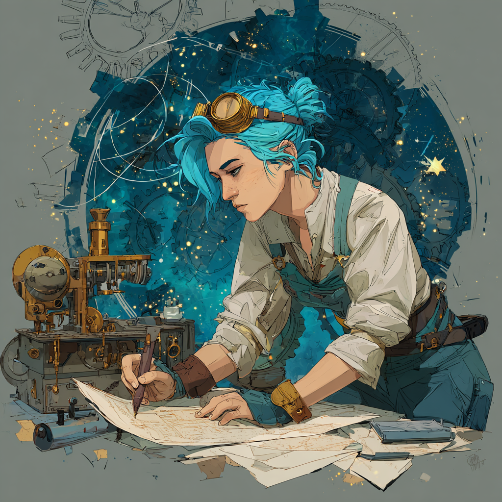

## Overview

Images are an essential component of documentation, serving to illustrate concepts, display screenshots, and visualize data. Introligo supports images through markdown includes, simplifying the integration of visual content into documentation.

## Image Organization

### Directory Structure

For Sphinx documentation, images should be placed in the `_static` directory:

```text
docs/
├── _static/
│   └── images/              # Images for documentation
│       ├── logo.png
│       ├── screenshot1.png
│       └── diagram.svg
├── composition/
│   └── markdown/
│       └── md_tutorial/
│           └── working_with_images.md
└── generated/               # Generated RST files
    └── user_guide/
        └── markdown_includes/
            └── working_with_images.rst
```

**Rationale for using `_static`:**

The `_static` directory is Sphinx's standard location for static assets including images, CSS, and JavaScript. Files in `_static` are automatically copied to the build output and remain accessible via the `_static/` path in generated documentation.

## Including Images in Markdown

### Basic Image Syntax

Use standard markdown image syntax with paths to `_static/images`:

```markdown

```

### Image with Title

```markdown

```

### Understanding Image Paths

**Important**: Paths must be relative to where the generated RST files will be located, not relative to the markdown source file.

For Introligo with default settings:
- Markdown files are in: `docs/composition/markdown/md_tutorial/`
- Generated RST files end up in: `docs/generated/user_guide/markdown_includes/`
- Images should be in: `docs/_static/images/`
- Therefore, use path: `../../../_static/images/filename.png` (go up 3 levels, then into _static/images)

```markdown
# Standard path for images in Introligo documentation

```

## Image Examples

### Example 1: Simple Image

The first example demonstrates basic image inclusion:


This image demonstrates a basic image inclusion. The syntax used:

```markdown

```

**Note**: The path `../../../_static/images/` works because:
- Generated RST files are in `docs/generated/user_guide/markdown_includes/`
- Go up 3 levels (`../../../`) to reach `docs/`
- Then access `_static/images/` directory where images are stored

### Example 2: Image with Caption

The second example demonstrates the use of descriptive alt text:



This image includes more descriptive alt text for better accessibility:

```markdown

```

## Best Practices

### 1. Use Descriptive Alt Text

Always provide meaningful alt text for accessibility:

```markdown
Recommended: 
Not recommended:  
```

### 2. Optimize Image Sizes

- **PNG**: Good for screenshots, diagrams, logos
- **JPG/JPEG**: Good for photos, complex images
- **SVG**: Best for diagrams, icons (scalable)
- **GIF**: For simple animations

Recommended maximum dimensions:
- Screenshots: 1920px width maximum
- Diagrams: 1200px width maximum
- Icons/logos: 512px maximum

### 3. Consistent Naming Convention

Use clear, descriptive filenames:

```text
Recommended:
  - user-login-flow.png
  - architecture-diagram.svg
  - installation-screenshot-01.png

Not recommended:
  - img1.png
  - screenshot.png
  - pic.jpg
```

### 4. Image Directory Organization

For large projects, organize by category in `_static/images`:

```text
docs/_static/images/
├── screenshots/
│   ├── installation/
│   │   ├── step1.png
│   │   └── step2.png
│   └── usage/
│       └── interface.png
├── diagrams/
│   ├── architecture.svg
│   └── workflow.svg
└── logos/
    └── project-logo.png
```

Reference with subdirectories (adjust `../../../` based on your RST depth):

```markdown


```

## Advanced Techniques

### Responsive Images

While markdown doesn't support responsive images directly, you can use RST directives in your markdown when needed. Introligo converts markdown to RST, so you can mix formats:

```markdown
This is markdown text.

.. figure:: ../../../_static/images/diagram.png
   :width: 80%
   :align: center
   :alt: System Architecture

   System Architecture Diagram
```

### Image Alignment

For centered images in RST (mixed with markdown):

```rst
.. image:: ../../../_static/images/logo.png
   :align: center
   :width: 300px
```

### Multiple Images in a Row

Using RST table syntax for side-by-side images (using your actual images):

```rst
.. list-table::
   :widths: 50 50

   * - .. figure:: ../../../_static/images/image1.png
          :width: 100%

          Caption for Image 1

     - .. figure:: ../../../_static/images/image2.png
          :width: 100%

          Caption for Image 2
```

## Image Checklist

Before adding images to documentation:

- [ ] Image is optimized for web (reasonable file size)
- [ ] Filename is descriptive and uses kebab-case
- [ ] Alt text is meaningful and descriptive
- [ ] Image is in the `_static/images` directory or subdirectory
- [ ] Relative path is correct from generated RST location
- [ ] Image format is appropriate (PNG/JPG/SVG)
- [ ] Image is version controlled (committed to git)
- [ ] Copyright/license is clear (if not your own image)

## Example Configuration

The following demonstrates how to include this tutorial with images in `introligo_config.yaml`:

```yaml
modules:
  markdown_images:
    parent: "markdown_includes"
    title: "🖼️ Working with Images"
    description: "How to include and work with images in documentation"
    markdown_includes: "markdown/md_tutorial/working_with_images.md"
```

## Additional Recommendations

### Version Control for Images

Always commit images to your repository so the documentation builds correctly for all team members:

```bash
git add docs/_static/images/new-image.png
git commit -m "docs: Add new diagram to image tutorial"
```

### Preview Before Committing

Build and preview documentation locally before committing changes:

```bash
python -m introligo docs/composition/introligo_config.yaml -o docs
cd docs && sphinx-build -b html . _build/html
```

### Dark Mode Considerations

For documentation supporting dark mode themes, consider providing alternative images or using SVGs with appropriate colors.

### Accessibility Considerations

Proper alt text provides multiple benefits:
- Assists screen reader users in understanding content
- Provides fallback when images fail to load
- Improves search engine indexing of documentation

## Related Documentation

- [Markdown Best Practices →](./best_practices.md) - Writing effective markdown
- [Basic Usage →](./basic_usage.md) - Getting started with markdown includes
- [Sphinx Documentation - Images](https://www.sphinx-doc.org/en/master/usage/restructuredtext/basics.html#images) - RST image directive reference
